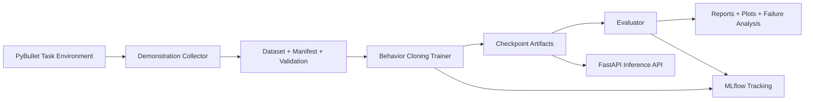

# GripGround: Language-Guided Robotic Manipulation with Failure-Aware Learning

GripGround is a simulation-first portfolio project that implements an end-to-end robotics ML workflow:
data collection, dataset validation, language-conditioned behavior cloning, baseline vs trained evaluation,
failure analysis, MLflow tracking, and FastAPI serving.

## Problem statement

Given a camera observation, robot state, and natural language instruction, predict an action for a pick-and-place task:
move a red cube to a green target region on a tabletop.

## Simulator and model choice

- **Target simulator from the original plan:** ManiSkill
- **What was implemented in this environment:** PyBullet fallback with a real physics scene and Panda robot
- **Why fallback was needed:** in this VM, `mani_skill==3.0.1` requires `mplib==0.1.1`, which is unavailable for this Python setup, so ManiSkill installation fails.

The policy is a **trainable imitation-learning model** (behavior cloning), not a pretrained VLA model.
Language conditioning uses a learned token embedding (not a pretrained LLM encoder).

## Architecture



## Project structure

- [src/gripground/](/home/akhil/language-guided-robot-manipulation/src/gripground/)
  - [config.py](/home/akhil/language-guided-robot-manipulation/src/gripground/config.py)
  - [env/task_environment.py](/home/akhil/language-guided-robot-manipulation/src/gripground/env/task_environment.py)
  - [env/simulator_adapter.py](/home/akhil/language-guided-robot-manipulation/src/gripground/env/simulator_adapter.py)
  - [data/collect_demonstrations.py](/home/akhil/language-guided-robot-manipulation/src/gripground/data/collect_demonstrations.py)
  - [data/dataset.py](/home/akhil/language-guided-robot-manipulation/src/gripground/data/dataset.py)
  - [data/validate_dataset.py](/home/akhil/language-guided-robot-manipulation/src/gripground/data/validate_dataset.py)
  - [models/policy.py](/home/akhil/language-guided-robot-manipulation/src/gripground/models/policy.py)
  - [models/visual_encoder.py](/home/akhil/language-guided-robot-manipulation/src/gripground/models/visual_encoder.py)
  - [models/language_encoder.py](/home/akhil/language-guided-robot-manipulation/src/gripground/models/language_encoder.py)
  - [training/train_policy.py](/home/akhil/language-guided-robot-manipulation/src/gripground/training/train_policy.py)
  - [training/evaluate_policy.py](/home/akhil/language-guided-robot-manipulation/src/gripground/training/evaluate_policy.py)
  - [evaluation/metrics.py](/home/akhil/language-guided-robot-manipulation/src/gripground/evaluation/metrics.py)
  - [evaluation/error_analysis.py](/home/akhil/language-guided-robot-manipulation/src/gripground/evaluation/error_analysis.py)
  - [evaluation/generate_report.py](/home/akhil/language-guided-robot-manipulation/src/gripground/evaluation/generate_report.py)
  - [tracking/mlflow_utils.py](/home/akhil/language-guided-robot-manipulation/src/gripground/tracking/mlflow_utils.py)
  - [serving/app.py](/home/akhil/language-guided-robot-manipulation/src/gripground/serving/app.py)
  - [serving/schemas.py](/home/akhil/language-guided-robot-manipulation/src/gripground/serving/schemas.py)
  - [utils/reproducibility.py](/home/akhil/language-guided-robot-manipulation/src/gripground/utils/reproducibility.py)
  - [utils/logging_utils.py](/home/akhil/language-guided-robot-manipulation/src/gripground/utils/logging_utils.py)
- [tests/](/home/akhil/language-guided-robot-manipulation/tests/)
- [configs/defaults.json](/home/akhil/language-guided-robot-manipulation/configs/defaults.json)
- [scripts/run_full_pipeline.sh](/home/akhil/language-guided-robot-manipulation/scripts/run_full_pipeline.sh)

## Environment setup

```bash
python3 -m venv .venv
.venv/bin/pip install --upgrade pip
.venv/bin/pip install --index-url https://download.pytorch.org/whl/cpu torch==2.7.1
.venv/bin/pip install -r requirements.txt
.venv/bin/pip install -e .
```

## Data collection and schema

Collect demonstrations:

```bash
.venv/bin/python -m gripground.data.collect_demonstrations --output-dir artifacts/data --episodes 30 --seed 42 --max-steps 120
```

Validate dataset:

```bash
.venv/bin/python -m gripground.data.validate_dataset --dataset-dir artifacts/data
```

Each episode NPZ stores:
- `images`: `uint8 [T,64,64,3]`
- `states`: `float32 [T,11]`
- `actions`: `float32 [T,4]` continuous clipped in `[-1, 1]`
- `instruction`: task text
- `rewards`, `dones`, `success`, `failure_category`, `seed`

Manifest: [artifacts/data/dataset_manifest.json](/home/akhil/language-guided-robot-manipulation/artifacts/data/dataset_manifest.json)

## Training and evaluation

Train:

```bash
.venv/bin/python -m gripground.training.train_policy --dataset-dir artifacts/data --output-dir artifacts/checkpoints --epochs 8 --batch-size 32 --learning-rate 0.001 --seed 42
```

Evaluate baseline vs trained:

```bash
.venv/bin/python -m gripground.training.evaluate_policy --dataset-dir artifacts/data --checkpoint artifacts/checkpoints/best.pt --reports-dir reports --episodes 20 --seed 123
```

Generate final markdown report:

```bash
.venv/bin/python -m gripground.evaluation.generate_report --reports-dir reports
```

## Iterative improvement experiment

Hypothesis: add image jitter augmentation and train longer.

```bash
.venv/bin/python -m gripground.training.train_policy --dataset-dir artifacts/data --output-dir artifacts/checkpoints_improved --epochs 12 --batch-size 32 --learning-rate 0.0008 --seed 42 --image-jitter 0.03
.venv/bin/python -m gripground.training.evaluate_policy --dataset-dir artifacts/data --checkpoint artifacts/checkpoints_improved/best.pt --reports-dir reports/improvement --episodes 20 --seed 123
```

Comparison report: [reports/improvement_summary.json](/home/akhil/language-guided-robot-manipulation/reports/improvement_summary.json)

## MLflow usage

Training logs parameters/metrics/artifacts to local store: `file:./artifacts/mlruns`.

Launch UI:

```bash
.venv/bin/python -m mlflow ui --backend-store-uri file:./artifacts/mlruns --host 127.0.0.1 --port 5000
```

## FastAPI inference service

Run service:

```bash
GRIPGROUND_MODEL_PATH=artifacts/checkpoints/best.pt .venv/bin/python -m uvicorn gripground.serving.app:app --host 0.0.0.0 --port 8000
```

Endpoints:
- `GET /health`
- `GET /model-info`
- `POST /predict`

Example `predict` payload fields:
- `instruction: string`
- `image_base64: base64-encoded RGB image`
- `state: optional 11-float vector`

## Docker

Build:

```bash
docker build -t gripground:latest .
```

Run:

```bash
docker run --rm -p 8000:8000 -e GRIPGROUND_MODEL_PATH=/models/best.pt -v "$(pwd)/artifacts/checkpoints:/models:ro" gripground:latest
```

Or with compose:

```bash
docker compose up --build
```

## Measured results (from actual runs)

From [reports/evaluation_summary.json](/home/akhil/language-guided-robot-manipulation/reports/evaluation_summary.json):

- Evaluation episodes: 20
- Baseline success rate: 0.05
- Trained success rate: 0.05
- Action prediction MSE on test split: 0.0785
- Dominant failure category: timeout

Plot: [reports/baseline_vs_trained.png](/home/akhil/language-guided-robot-manipulation/reports/baseline_vs_trained.png)

Failure analysis: [reports/failure_analysis.json](/home/akhil/language-guided-robot-manipulation/reports/failure_analysis.json)

## What I implemented

- Real PyBullet pick-and-place simulation with robot, cube, target, action execution, reset seeding, and success/failure detection.
- Demonstration collection pipeline with scripted expert trajectories and compressed episode storage.
- Dataset validation for shape checks, NaN/inf checks, action bounds, duplicate IDs, and split leakage.
- Language-conditioned imitation-learning policy (vision encoder + learned instruction embedding + state branch).
- Baseline vs trained evaluation on held-out seeds with latency and action-MSE reporting.
- MLflow integration for training metrics, params, and artifacts.
- FastAPI inference API with startup checkpoint loading and request validation.
- Docker and docker-compose packaging for inference deployment.
- Automated test suite for environment, dataset, model I/O, metrics, reproducibility, checkpoints, and API paths.

## Limitations and future improvements

- The current scripted expert has low task success, limiting policy quality.
- Only one task family is evaluated.
- Language encoder is lightweight and learned from task text, not pretrained semantics.
- No physical robot validation.

## Upstream references and licenses

- PyBullet: https://pybullet.org
- Gymnasium: https://gymnasium.farama.org
- PyTorch: https://pytorch.org
- MLflow: https://mlflow.org
- FastAPI: https://fastapi.tiangolo.com
- ManiSkill installation docs (checked during setup): https://maniskill.readthedocs.io/en/latest/user_guide/getting_started/installation.html

All external libraries remain under their original licenses; project code in this repository is under [LICENSE](/home/akhil/language-guided-robot-manipulation/LICENSE).

## Code ownership distinction

- **Custom code in this repository:** simulation wrapper, dataset/validation pipeline, policy architecture, training/evaluation scripts, API service, tests, and project packaging.
- **Reused third-party libraries:** physics engine, deep learning framework, web framework, plotting/tracking tooling.
