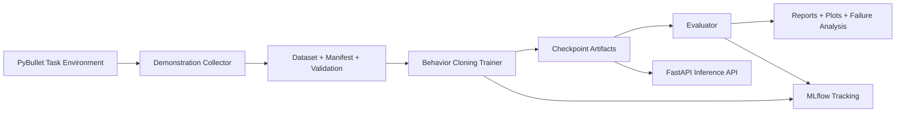

# GripGround: Language-Guided Robotic Manipulation with Failure-Aware Learning

GripGround is a simulation-first portfolio project that implements an end-to-end robotics ML workflow:
data collection, dataset validation, language-conditioned behavior cloning, baseline vs trained evaluation,
failure analysis, MLflow tracking, and FastAPI serving.

## Quick start

With dependencies installed, run the complete collection, validation, training, evaluation, and report
pipeline with:

```bash
PYTHON=.venv/bin/python bash scripts/run_full_pipeline.sh
```

Run the automated tests with `.venv/bin/python -m pytest -q`. Generated datasets, checkpoints, and MLflow
tracking data are stored under `artifacts/`; experiment reports and plots are written to `reports/`.

## Problem statement

Given a camera observation, robot state, and natural language instruction, predict an action for a pick-and-place task:
move a red cube to a green target region on a tabletop.

## Simulator and model choice

- **Target simulator from the original plan:** ManiSkill
- **What was implemented in this environment:** a PyBullet physics scene with a visible Cartesian parallel-jaw gripper, dynamic cube, tabletop, gravity, camera observations, and grasp constraints
- **Why fallback was needed:** in this VM, `mani_skill==3.0.1` requires `mplib==0.1.1`, which is unavailable for this Python setup, so ManiSkill installation fails.

The policy is a **trainable imitation-learning model** (behavior cloning), not a pretrained VLA model.
Language conditioning uses a learned token embedding (not a pretrained LLM encoder).
The gripper moves kinematically in bounded Cartesian increments; object motion, gravity, contact with the table, and the grasp/release constraint are simulated by PyBullet. This is not torque-level control of a full articulated arm.

## Architecture



## Project structure

- [src/gripground/](src/gripground/)
  - [config.py](src/gripground/config.py)
  - [env/task_environment.py](src/gripground/env/task_environment.py)
  - [env/simulator_adapter.py](src/gripground/env/simulator_adapter.py)
  - [data/collect_demonstrations.py](src/gripground/data/collect_demonstrations.py)
  - [data/dataset.py](src/gripground/data/dataset.py)
  - [data/validate_dataset.py](src/gripground/data/validate_dataset.py)
  - [models/policy.py](src/gripground/models/policy.py)
  - [models/visual_encoder.py](src/gripground/models/visual_encoder.py)
  - [models/language_encoder.py](src/gripground/models/language_encoder.py)
  - [training/train_policy.py](src/gripground/training/train_policy.py)
  - [training/evaluate_policy.py](src/gripground/training/evaluate_policy.py)
  - [evaluation/metrics.py](src/gripground/evaluation/metrics.py)
  - [evaluation/error_analysis.py](src/gripground/evaluation/error_analysis.py)
  - [evaluation/generate_report.py](src/gripground/evaluation/generate_report.py)
  - [evaluation/compare_safety_trials.py](src/gripground/evaluation/compare_safety_trials.py)
  - [tracking/mlflow_utils.py](src/gripground/tracking/mlflow_utils.py)
  - [serving/app.py](src/gripground/serving/app.py)
  - [serving/schemas.py](src/gripground/serving/schemas.py)
  - [utils/reproducibility.py](src/gripground/utils/reproducibility.py)
  - [utils/logging_utils.py](src/gripground/utils/logging_utils.py)
- [tests/](tests/)
- [configs/defaults.json](configs/defaults.json)
- [scripts/run_full_pipeline.sh](scripts/run_full_pipeline.sh)

## Environment setup

```bash
python3 -m venv .venv
.venv/bin/pip install --upgrade pip
.venv/bin/pip install --index-url https://download.pytorch.org/whl/cpu torch==2.7.1
.venv/bin/pip install -r requirements.txt
.venv/bin/pip install -e .
```

## Data collection and schema

Collect demonstrations:

```bash
.venv/bin/python -m gripground.data.collect_demonstrations --output-dir artifacts/data --episodes 90 --seed 42 --max-steps 60
```

Validate dataset:

```bash
.venv/bin/python -m gripground.data.validate_dataset --dataset-dir artifacts/data
```

Each episode NPZ stores:
- `images`: `uint8 [T,64,64,3]`
- `states`: `float32 [T,12]` (end-effector, cube, target positions and gripper/attachment/task-phase state)
- `actions`: `float32 [T,4]` continuous clipped in `[-1, 1]`
- `instruction`: task text
- `rewards`, `dones`, `success`, `failure_category`, `seed`

Manifest: `artifacts/data/dataset_manifest.json`

## Training and evaluation

Train:

```bash
.venv/bin/python -m gripground.training.train_policy --dataset-dir artifacts/data --output-dir artifacts/checkpoints --epochs 50 --batch-size 64 --learning-rate 0.001 --seed 42
```

Evaluate baseline vs trained:

```bash
.venv/bin/python -m gripground.training.evaluate_policy --dataset-dir artifacts/data --checkpoint artifacts/checkpoints/best.pt --reports-dir reports --episodes 30 --seed 123
```

Generate final markdown report:

```bash
.venv/bin/python -m gripground.evaluation.generate_report --reports-dir reports
```

## Iterative improvement experiment

An earlier exploratory image-jitter experiment (12 epochs, jitter std 0.03) is recorded in
`reports/improvement_summary.json`. It regressed on that run's small evaluation set and predates the final
environment and training setup, so its results should not be compared with the final benchmark above.
The following commands rerun that experiment configuration; results may vary:

```bash
.venv/bin/python -m gripground.training.train_policy --dataset-dir artifacts/data --output-dir artifacts/checkpoints_improved --epochs 12 --batch-size 32 --learning-rate 0.0008 --seed 42 --image-jitter 0.03
.venv/bin/python -m gripground.training.evaluate_policy --dataset-dir artifacts/data --checkpoint artifacts/checkpoints_improved/best.pt --reports-dir reports/improvement --episodes 20 --seed 123
```

The safety-interlock trials recorded 86.7% and 100% success, respectively, on 30 episodes each. These are descriptive results, **not a controlled causal comparison**: the dataset hashes differ, and the reports do not fingerprint checkpoint weights. Recreate the metadata comparison with:

```bash
.venv/bin/python -m gripground.evaluation.compare_safety_trials
```

Output: `reports/safety_interlock_comparison.json`.

## MLflow usage

Training logs parameters/metrics/artifacts to local store: `file:./artifacts/mlruns`.

Launch UI:

```bash
.venv/bin/python -m mlflow ui --backend-store-uri file:./artifacts/mlruns --host 127.0.0.1 --port 5000
```

## FastAPI inference service

Run service:

```bash
GRIPGROUND_MODEL_PATH=artifacts/checkpoints/best.pt .venv/bin/python -m uvicorn gripground.serving.app:app --host 0.0.0.0 --port 8000
```

Endpoints:
- `GET /health`
- `GET /model-info`
- `POST /predict`

Example `predict` payload fields:
- `instruction: string`
- `image_base64: base64-encoded RGB image`
- `state: optional 12-float vector`

## Docker

Build:

```bash
docker build -t gripground:latest .
```

Run:

```bash
docker run --rm -p 8000:8000 -e GRIPGROUND_MODEL_PATH=/models/best.pt -v "$(pwd)/artifacts/checkpoints:/models:ro" gripground:latest
```

Or with compose:

```bash
docker compose up --build
```

## Measured results (from actual runs)

From `reports/evaluation_summary.json`:

- Demonstration episodes: 90/90 expert successes
- Evaluation episodes: 30 (same evaluation seeds for baseline and trained policy)
- Random-action baseline success rate: 0.033
- Trained policy success rate: 0.933 (28/30)
- Trained average episode length: 26.97 steps
- Trained average inference latency: 2.01 ms per action
- Action prediction MSE on episode-held-out test split: 0.03797
- Trained-policy failures: 2 grasp failures

Plot: `reports/baseline_vs_trained.png`

Failure analysis: `reports/failure_analysis.json`

Full generated experiment report: `reports/experiment_report.md`.

These are measured results from one task family and 30 evaluation seeds, not a guarantee of performance on unseen language, scenes, or physical robots. Re-running the pipeline retrains from fresh simulation data; small metric changes are expected.

## What I implemented

- Real PyBullet pick-and-place simulation with a Cartesian gripper, dynamic cube, target, camera, reset seeding, and success/failure detection.
- Demonstration collection pipeline with scripted expert trajectories and compressed episode storage.
- Dataset validation for shape checks, NaN/inf checks, action bounds, duplicate IDs, and split leakage.
- Language-conditioned imitation-learning policy (vision encoder + learned instruction embedding + state branch).
- Baseline vs trained evaluation on held-out seeds with latency and action-MSE reporting.
- MLflow integration for training metrics, params, and artifacts.
- FastAPI inference API with startup checkpoint loading and request validation.
- Docker and docker-compose packaging for inference deployment.
- Automated test suite for environment, dataset, model I/O, metrics, reproducibility, checkpoints, and API paths.
- Reproducible Markdown experiment-report and safety-trial comparison generators.

## Limitations and future improvements

- The gripper is kinematically controlled, not torque controlled; arm dynamics are not modeled.
- Only one task family is evaluated.
- Language encoder is lightweight and learned from task text, not pretrained semantics.
- The evaluation set contains 30 seeds for this task family; it is a prototype benchmark rather than broad generalization evidence.
- No physical robot validation.

## Upstream references and licenses

- PyBullet: https://pybullet.org
- Gymnasium: https://gymnasium.farama.org
- PyTorch: https://pytorch.org
- MLflow: https://mlflow.org
- FastAPI: https://fastapi.tiangolo.com
- ManiSkill installation docs (checked during setup): https://maniskill.readthedocs.io/en/latest/user_guide/getting_started/installation.html

All external libraries remain under their original licenses; project code in this repository is under [LICENSE](LICENSE).

## Code ownership distinction

- **Custom code in this repository:** simulation wrapper, dataset/validation pipeline, policy architecture, training/evaluation scripts, API service, tests, and project packaging.
- **Reused third-party libraries:** physics engine, deep learning framework, web framework, plotting/tracking tooling.
