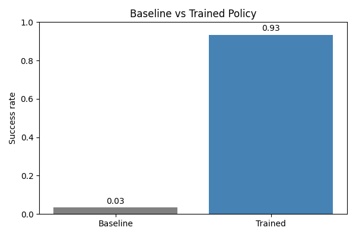

# GripGround Experiment Report

- Timestamp: 2026-10-09T13:44:30.249029+00:00
- Simulator: pybullet
- Dataset episodes: 90
- Dataset hash: 70a0c34f14d8202f4e64a31240d34c3c04ecb1ce2f06bba3719fea7ec291de69
- Dataset split strategy: episode
- Training method: behavior cloning
- Training epochs: 50
- Best validation loss: 0.02695
- Checkpoint: artifacts/checkpoints/best.pt
- Evaluation episodes: 30 (seed 123)

## Baseline vs Trained

- Random baseline success rate: 3.3% (1/30)
- Trained success rate: 93.3% (28/30)
- Trained average episode length: 26.97 steps
- Trained inference latency: 2.01 ms per action
- Held-out action prediction MSE: 0.03797

## Failure Analysis

Most common failure categories (baseline and trained runs combined): [['baseline::grasp_failure', 19], ['baseline::placement_failure', 10], ['grasp_failure', 2]]

- Trained-policy failures: {'grasp_failure': 2}
- Baseline failures: {'grasp_failure': 19, 'placement_failure': 10}
- Failed trajectory records: 31 (`reports/failed_trajectories.json`)

## Known Limitations

- Policy relies on imitation from scripted expert and may fail in unseen cube placements.
- Language conditioning uses learned token embeddings, not a pretrained language model.
- PyBullet fallback was used because ManiSkill dependency resolution failed in this environment.
- Training data is simulator-generated from scripted expert trajectories.
- Action-space model is continuous and clipped in [-1, 1].
- Evaluation uses a single simulated task family and not physical robot deployment.

The result is evidence for this simulated task and seed set, not a claim of broad language or physical-robot generalization.
